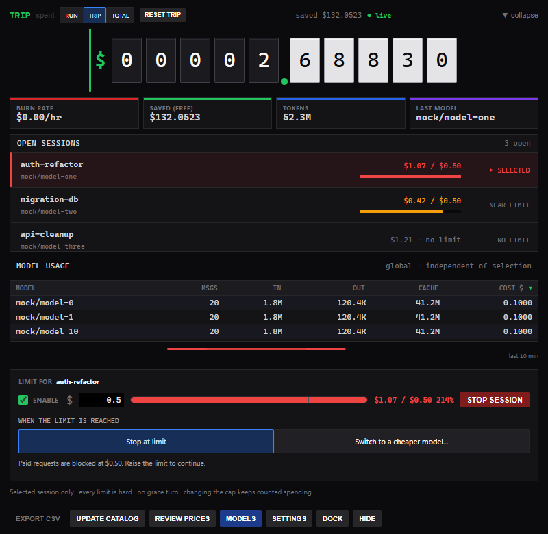
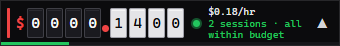
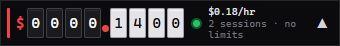
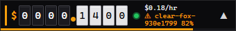
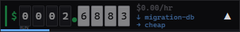
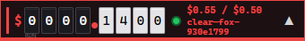
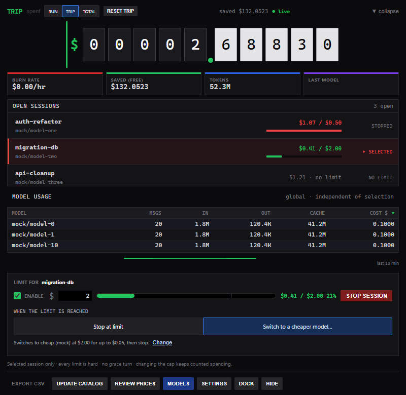
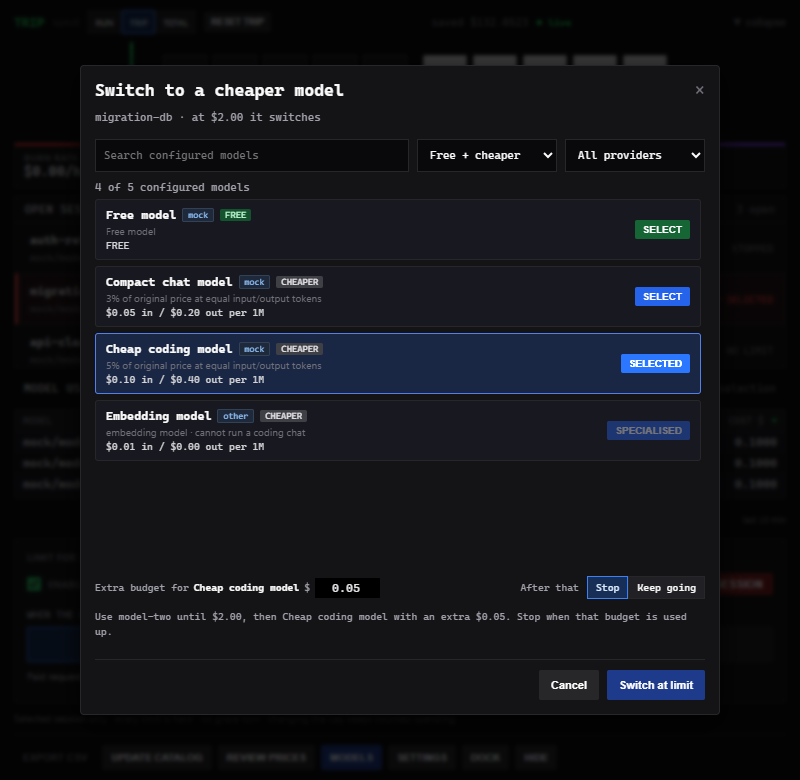

# OpenCode Odometer

A live, always-on-top spend meter for [OpenCode](https://opencode.ai) — with a
per-session budget that can actually stop a turn before it costs you money.

```
 $ 0 0 3 1 . 4 7 2 9      $2.14/hr   claude-opus-4-5
```

A companion plugin feeds it every assistant message from inside OpenCode. It
prices each one from a local table you control and shows the running total in a
compact draggable bar. Click to expand into a full per-model breakdown.

**Single executable.** No runtime to install — it seeds its own price table and
installs its own plugin on first run.

> **Windows** is the tested platform. The Go core is portable and
> `internal/lock` already has a Unix implementation; the gaps are in window
> placement and packaging. See [Contributing](#contributing).

## Screenshots

The current app UI, shown with demo sessions and spending data.

The expanded panel combines global usage with open sessions and controls for the selected session:



The compact dock stays at 340 × 46 and totals spending across open sessions:

| State | Dock |
|---|---|
| Limits set, all within budget |  |
| No limits set |  |
| A session reaches 75% |  |
| A session is on fallback |  |
| A session stops |  |

The compact limit section configures a separate fallback allowance:





See [automatic budget rules, metadata and validation](docs/BUDGET_RULES.md).

See [session behaviour and review steps](docs/MULTI_SESSION.md) for details.

---

## Why not just use `opencode stats`?

For most people, `opencode stats` is fine — use it.

This exists for three cases it does not cover:

| | `opencode stats` | Odometer |
|---|---|---|
| **Live display** | run a command | always-on-screen bar, updates continuously |
| **Spend limits** | none | per-session cap that blocks the turn |
| **Providers that report no cost** | shows `$0.00` | prices locally from your own table |

Some gateways, resellers and self-hosted proxies report no cost even when
they return token usage. Odometer can price that usage locally. See
[Private pricing](#private-pricing).

---

## Features

- **Open TUI sessions only**: each newly opened terminal gets a readable unique
  name before its first chat, shown inside OpenCode and in Odometer. Closed TUIs
  leave the list and lose their cap. New entries have no default limit.
- The 340 × 46 dock aggregates open-session spend and highlights the worst cap.
  Healthy states show the session count and budget summary. Warnings and breaches show
  the worst session's complete name, including its identifier; the tooltip lists all names.
  Expand to edit the selected limit or STOP its chat. The panel has independent scrolling
  for open sessions and global model usage; selecting a row targets its footer.
  See [implementation and review steps](docs/MULTI_SESSION.md).

- Starts as a compact bar; OpenCode auto-launch docks it bottom-centre above the taskbar.
  The widget stays on top when you switch windows; Hide to tray hides it explicitly.
- **Settings** has Start with OpenCode, idle dimming, optional outside-click collapse,
  and enforcement pause. Pausing keeps counting spend and resumes the same budget period.
  Settings and Hide to tray sit together at the bottom-right of the board.
  Stop Session acts on the selected row from the limit footer.
  Hover over Update Catalog to see the age of its prices.
  A single Review prices button opens estimated and unknown pricing details.
- **Stop Session** cancels the active chat and its delegated work with one click,
  and waits for OpenCode's acknowledgement. Other chats keep running. Restart
  OpenCode after a plugin update to activate this control.
- Click the expand arrow for spending details and a ten-minute spending sparkline.
  Switch the readout between spent and remaining. Hover keeps the window still.
- A chat's delegated child sessions share its spending cap and grace allowance.
- Completed live charges briefly show a `+$0.023` tick; replayed history stays quiet.
- Windows system tray provides show, hide, pause/resume and quit. Quit suppresses
  relaunch in existing OpenCode instances; a fresh OpenCode launch follows Settings.
- **Models** searches all models supplied by connected OpenCode providers, with
  Free + cheaper, Free and All filters. Unknown and estimated rates are labelled;
  cheaper compares equal input/output token counts. Specialised models stay visible.
- Choose **SWITCH MODEL** from either the model picker or the limit-reached
  screen. It applies from the next message and stays selected for that chat,
  including after a restart. The current response continues and the budget is
  preserved. See [Switching models](#switching-models).
- Open the rebuilt executable once, then restart OpenCode to activate the updated
  bundled plugin. Model routing requires a chat observed by that plugin.

- **Live odometer** — mechanical-style counter, labelled RUN, TRIP (resettable) and TOTAL. The compact dock always shows RUN across open TUIs.
- **Cache-aware pricing** — `input`, `output`, `cache_read` and `cache_write`
  priced separately, so cached tokens use the appropriate rate.
- **Per-open-session budget** — hard limits without grace, with an amber warning at 75%.
  Counts spending from TUI startup; setting or editing the limit re-evaluates immediately.
- **Blocks before the next provider call** — the plugin rechecks every model/tool
  step, waiting for the preceding usage to be accounted. A request already
  dispatched can still overshoot its allowance.
- **Automatic cheaper-model fallback** — a configured per-session rule stops the
  original turn at exhaustion, activates a separate fallback allowance and submits
  one continuation in the same conversation. Manual STOP suppresses continuation.
- **Measured model facts** — models.dev capabilities plus optional Artificial
  Analysis scores/speed; exact matches only, with unmatched models labelled Not rated.
- **Auto-updating prices** — ~1,090 models from [models.dev](https://models.dev),
  refreshed in the background. A snapshot is compiled into the binary as an
  offline floor.
- **Private price overlay** for internal/reseller rates that never touches git.
- **Free-model savings** — models ending `-free` or containing `sovereign` cost
  nothing and accrue a "would have cost" figure.
- **Unknown-model prompt** — a model with no rate contributes $0 and is
  invisible to the budget, so the app surfaces it and offers the best public
  match (or a family-median fallback). Cache prices inherit from that public
  match unless you explicitly customize them. Saved prices remain editable.
- **Explainable hybrid accounting** — an explicit local/free setting wins,
  then a non-zero OpenCode event cost, then exact catalog pricing, then a
  deterministic cross-provider estimate. Each ledger record keeps its source.
- **CSV export** of every priced message.

---

## Install

### From a release

1. Download `OpenCode_Odometer.exe` from
   [Releases](https://github.com/vivek9102/opencode-odometer/releases).
2. Run it. On first launch it writes its price table and installs the plugin
   into `~/.config/opencode/plugins/`. It also remembers that exact executable,
   so it may remain in Downloads, Desktop, or any other folder. If you move it
   later, run it once from the new location to update the pointer.
3. **Restart OpenCode** so it loads the plugin.

Windows SmartScreen will warn on an unsigned binary — *More info → Run anyway*.

Requires the [WebView2 runtime](https://developer.microsoft.com/microsoft-edge/webview2/),
present by default on Windows 11 and current Windows 10.

### From source

```powershell
git clone https://github.com/vivek9102/opencode-odometer.git
cd opencode-odometer
go run .
```

For a packaged build you also need the [Wails v2 CLI](https://wails.io):

```powershell
go install github.com/wailsapp/wails/v2/cmd/wails@latest
.\build_exe.bat
```

`build_exe.bat` syncs embedded assets, regenerates the icon, and builds to
`build\bin\`. It fails loudly if the Wails CLI is missing rather than falling
back to `go build`, which silently produces a binary with no icon.

---

## How it works

OpenCode usually serves its API **in-process**, so there is no TCP port to
attach to. The plugin runs *inside* OpenCode, receives every assistant message,
and appends it to a spool file the odometer tails.

```
OpenCode
  └── plugin/odometer.js ──appends──> events.jsonl ──tailed──> Odometer
                                                                  │
                                          prices.json ────────────┤
                                          prices.local.json ──────┤
                                                                  ▼
                                                    ledger ──> budget.json
                                                                  │
                            plugin reads verdict <────────────────┘
```

An HTTP/SSE client is retained as a fallback for setups that do expose a port.
`stream disconnected: dial tcp 127.0.0.1:4096` in the log is **normal**, not a
fault — it means the in-process path is in use.

`budget.json` has exactly one writer (the odometer). When the plugin grants a
grace turn it records that in a separate `grace_claims.json`, which the
odometer absorbs and deletes — a one-way mailbox that avoids a write race. The
claim is written atomically and **fails closed**: if it cannot be persisted the
plugin blocks rather than granting grace it cannot account for.

---

## Pricing

Two files, and the distinction matters:

| File | What it is | On refresh |
|---|---|---|
| `prices.json` | Public catalogue from models.dev | **Overwritten** |
| `prices.local.json` | Your private/reseller rates | **Never touched** |

Refreshing public rates can therefore never destroy private ones.

Every figure is **USD per 1,000,000 tokens**.

### Private pricing

If your provider is not on models.dev — an internal gateway, a reseller, a
self-hosted proxy — put its rates in `prices.local.json`. Copy
`prices.local.example.json` to start. It is gitignored and merged on top of the
public table at load.

```json
{
  "models": {
    "yourprovider/some-model": {
      "name": "Some Model",
      "input": 2.50,
      "output": 10.00,
      "cache_read": 0.25,
      "cache_write": 3.13
    }
  }
}
```

The UI also prompts for any model it sees with no rate, pre-filled with the
median of that model's family.

### Refresh lifecycle

Startup reads the local table — **no network call**, so the UI never waits and
an offline machine still works. A background refresh runs shortly after and
every 6h thereafter, updating anything older than 24h. **UPDATE CATALOG**
forces it with visible success or failure. Catalog changes apply to future
messages only; completed totals do not move when a price file is refreshed.

Prices do move: a sample comparison found ~2% of entries changed within four
days, which is why the embedded snapshot is a floor rather than the source of
truth.

---

## Budget enforcement

Each open TUI starts without a limit. Setting one controls that conversation and
its delegated children. Limits are hard: warning at 75%, then blocking further
paid requests at 100%, without a grace turn. An in-flight request can overshoot.
The dock aggregates open-session RUN spending, while the footer edits only the
selected session. TRIP/TOTAL and the model usage table remain global.

Open-session spending is counted from TUI startup, including before a limit is
enabled. Editing a cap, resetting TRIP or restarting Odometer preserves it. Closing a TUI removes
its rule/cap but preserves history. Two TUIs sharing one conversation cannot have
independent execution; automatic fallback is refused for that shared conversation.

Choose **Stop at limit** or configure **Switch to a cheaper model…** with an eligible fallback.
Switching happens at exhaustion, through stop → prepare → activate fallback → one
automatic continuation. A paid fallback has its own allowance and **Stop / Keep
going** choice; a confirmed free route has no paid cap. Raising or clearing the
original limit restores its model when counted spending is below the new cap.
STOP SESSION cancels current activity like Esc, suppresses automatic continuation
of that task, and leaves the allowance unchanged. A later user message follows
the normal budget policy.

Known free models remain available after automatic paid-budget exhaustion.
Unknown prices are never classified as
free. Keep Odometer running: the existing bridge stops enforcing after its verdict
heartbeat expires. Details, metadata setup, limits and review steps are in
[Automatic session budget rules](docs/BUDGET_RULES.md).

## Switching models

1. Open **MODELS**, or choose a model on the limit-reached screen.
2. Click **SWITCH MODEL**. The next message uses that model, and later messages
   in the same chat keep using it until you replace or clear the choice.
3. Odometer confirms the choice when the matching assistant response reports
   the selected model. Other chats keep their own selections.
4. To return control to OpenCode, click **Use OpenCode selection** in the model
   picker, then select a model with OpenCode's `/model` command. Selecting again
   in Odometer saves a new choice for this chat.

The current plugin API does not expose a reliable native model-selection
event. While an Odometer choice is saved, `/model` alone does not clear it;
OpenCode's displayed selection may differ from the model used for requests.
Specialised models remain listed but cannot be selected for a coding chat.
An unavailable saved model produces an error instead of silently falling
back to the default.

After installing an updated bundled plugin, run Odometer once and restart
OpenCode. Send a message in the target chat so the plugin can observe it.
UI-only updates do not require another OpenCode restart.

## Startup and system tray

**Settings → Start with OpenCode** controls automatic startup. Turn it off
to launch Odometer manually from its executable or a shortcut. Open Settings
and turn it on again to restore automatic startup. Tracking and budget
settings are preserved.

**Hide to tray** keeps Odometer running. Find its icon near the Windows clock
(or under the hidden-icons arrow), then double-click it or choose **Show**
from its menu. **Quit** exits Odometer and suppresses relaunch in already
running OpenCode instances; a fresh OpenCode launch follows the startup setting.

## Controls

| Action | How |
|---|---|
| Expand / collapse | Click the expand arrow or double-click the bar; <kbd>Esc</kbd> collapses |
| Move | Drag the bar |
| Cycle dock position | <kbd>F2</kbd> or `DOCK` |
| TRIP / TOTAL | Click the odometer or `TRIP / TOTAL` |
| Reset trip | `RESET TRIP` |
| Download catalog for future usage | `UPDATE CATALOG` |
| Review, update, or reset private-provider prices | `CUSTOM PROVIDER PRICES` |
| Search and switch models | `MODELS`, or the limit-reached screen |
| Spent / remaining | Click the reading label in spending details |
| Startup / idle / pause settings | `SETTINGS` |
| Abort the active session | `STOP SESSION` |
| Export ledger | `EXPORT CSV` |
| Hide to tray / quit | Right-click the bar; restore from the Windows tray |

---

## Configuration

| Variable | Effect |
|---|---|
| `OPENCODE_ODOMETER_DIR` | Override the data directory |
| `OPENCODE_ODOMETER_POINTER` | Override the plugin discovery pointer |
| `OPENCODE_ODOMETER_EXE` | Override the executable used for plugin auto-start |
| `OPENCODE_PLUGIN_DIR` | Override where the plugin installs |
| `OPENCODE_URL` | OpenCode server URL (default `http://127.0.0.1:4096`) |
| `OPENCODE_ODOMETER=0` | Disable the plugin and auto-launch entirely |
| `OPENCODE_ODOMETER_NOBLOCK=1` | Keep tracking, never refuse a turn |

Data lives in `%LOCALAPPDATA%\OpenCodeOdometer\` on Windows,
`~/Library/Application Support/OpenCodeOdometer/` on macOS, and
`$XDG_DATA_HOME/OpenCodeOdometer/` on Linux.

---

## Optional event diagnostics

The separate `plugin/event-diagnostics.js` troubleshooting plugin is off by
default. To use it, copy it into OpenCode's plugin directory and remove the
older `test-events.js` full-event logger if installed. Set
`OPENCODE_EVENT_DIAGNOSTICS=1` before starting OpenCode.

It records metadata summaries without prompt or response text, coalesces
streaming updates, flushes asynchronously every 250 ms, and rotates at 1 MB
with one previous file. Summaries still include session and message identifiers,
model names and usage; keep the logs private. Unflushed entries can be lost on
exit. Budget accounting uses Odometer's separate event spool.

`OPENCODE_EVENT_DIAGNOSTICS_FILE` overrides the default
`~/.opencode/test-events.log`. OpenCode's own logs remain available when this
optional logger is disabled.

## Troubleshooting

The log is `opencode_odometer_events.log` in the data directory.

| Symptom | Cause |
|---|---|
| Everything reads `$0.00`, log shows `unknown=true` | No price table loaded |
| Cost stops moving | Check the discovery pointer (below) |
| `stream disconnected: dial tcp ...:4096` | **Normal** — in-process API |
| Window never appears | WebView2 runtime missing |
| Nothing happens on launch | Another instance holds the lock |
| Model picker asks for a restart | Run the updated Odometer, restart OpenCode, then send a message in that chat |
| `/model` seems ignored | Clear the saved choice with **Use OpenCode selection** first |
| Hidden window | Restore it from the tray icon, including Windows' hidden-icons area |

If cost stops updating, the plugin may be writing somewhere the odometer is not
reading. Check `~/.opencode-odometer.json` — its `data_dir` should match the
directory the app is using.

---

## Contributing

```powershell
go test ./...
go vet ./...
node --check plugin\odometer.js
node --check frontend\dist\main.js
node --check frontend\dist\experience.js
node --test plugin\*.test.mjs
```

See [CONTRIBUTING.md](CONTRIBUTING.md).

**Most useful contribution: macOS / Linux support.** The Go core is portable
and `internal/lock` already has a Unix build; the remaining work is window
placement, dock offsets, and packaging.

Two things to know before changing pricing or enforcement:

- **`frontend/dist` is source, not build output.** It is hand-written and
  embedded via `//go:embed`. There is no bundler.
- **Embedded assets are duplicated.** `//go:embed` cannot reach outside its
  package, so `plugin/odometer.js` and `prices.json` are copied into
  `internal/app/` and `internal/prices/`. `build_exe.bat` syncs them and a test
  fails the build if they drift.

---

## License

MIT — see [LICENSE](LICENSE).
