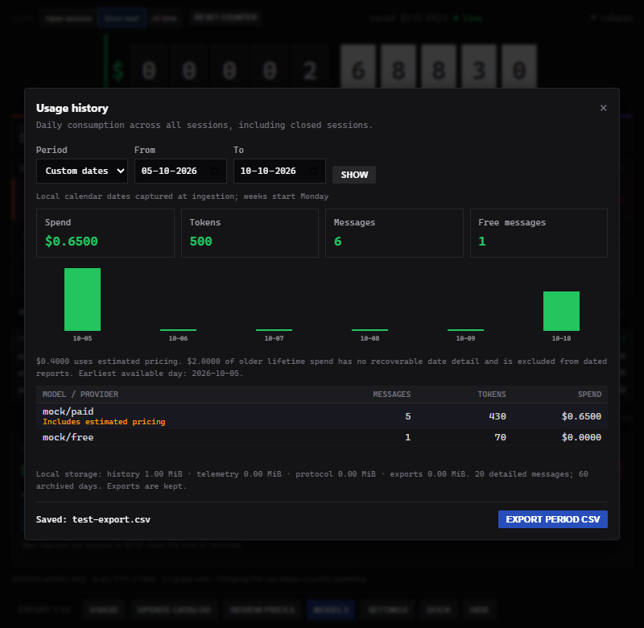

# OpenCode Odometer

A live spend meter for [OpenCode](https://opencode.ai), with per-session budgets,
automatic model fallback and local usage reports.

Odometer displays usage in an always-on-top desktop widget. Its companion plugin
reports token usage, enforces configured limits and can continue a conversation
on a cheaper model. Costs use provider-reported amounts or local pricing,
including custom rates for private gateways.

Windows x64 is the tested desktop platform. The release is a single executable
that installs its companion plugin on first launch. It requires Microsoft
WebView2 Runtime, normally available on Windows 11 and current Windows 10.

## Install or upgrade

1. Download the Windows executable from [Releases](https://github.com/vivek9102/opencode-odometer/releases).
2. Quit the previous Odometer instance, then run the downloaded executable once.
   This installs the bundled plugins and records the executable's location.
3. Restart OpenCode to load the plugins. Newly opened terminal UI instances
   start without limits; configure their budgets as needed. Saved preferences,
   pricing and usage history are retained.

The executable is unsigned. If Windows blocks it, right-click the downloaded
file and select **Properties → Unblock → Apply**, then run it again. If
SmartScreen offers **More info → Run anyway**, that is another option. On a
managed computer where these options are unavailable, ask your administrator
to approve the executable. Do not disable Windows security.

The release includes a `.sha256` checksum file. If you move the executable, run
it once from its new location so OpenCode can find it.

## Features

- **Open sessions:** current OpenCode terminal UI instances appear before their
  first chat. Select a row to edit its budget or stop its current activity.
- **Hard budgets:** enabling a limit starts a fresh allowance. At exhaustion,
  block further paid requests or continue on a configured fallback model.
- **Automatic fallback:** interrupt the original turn and submit one
  continuation in the same conversation, using the selected provider/model.
  Paid fallbacks can stop at their own cap or keep going; free fallbacks have
  no spending cap.
- **Compact dock:** a 340 × 46 widget totals open-session spending and identifies
  the session needing attention. Expand it for session controls and global
  model usage, with separate scrolling areas.
- **Usage reports:** daily, weekly, monthly and custom date ranges, with a
  model/provider breakdown and CSV exports.
- **Custom pricing:** separate input, output, cache-read and cache-write rates,
  with private overrides and labelled estimates for routes without exact prices.
- **Model selection:** browse configured models and save a choice for one chat.
  Specialised models remain visible with an explanation of their limitations.
- **Tray controls:** show, hide, pause enforcement or quit. Settings also control
  automatic startup, idle dimming and optional outside-click collapse.

A budget blocks subsequent requests after reported spending reaches its limit.
An already dispatched request can overshoot. Keep Odometer running when relying
on enforcement; it is not a provider-side billing ceiling. See the
[budget guide](docs/BUDGET_RULES.md) for the full behaviour and limitations.

## Screenshots

These screenshots show the application with demo sessions and synthetic spending.

The expanded panel combines open sessions, global model usage and the selected
session's budget:

| Dock state | Display |
|---|---|
| Within budget |  |
| No limits |  |
| Near a limit |  |
| On fallback |  |
| Stopped |  |

Configure the fallback and its allowance before the original limit is reached:

After switching, the original allowance is labelled separately from the active
fallback. A paid fallback configured to stop displays its own progress:

**Keep going** counts paid usage without a stopping cap:

A free fallback also runs without a spending cap:

The Usage panel provides date-based totals and downloadable reports:

## Counters and reports

| Counter | Scope |
|---|---|
| Open sessions | Spending since each currently open TUI started, counting shared conversations once. The total falls when a TUI closes. |
| Since reset | Global spending since the last display-counter reset, including closed sessions. |
| All time | Lifetime spending, including archived totals. |

The dock always uses **Open sessions**. The expanded model usage table is global
and independent of the selected session. **RESET COUNTER** is available for
**Since reset**; it does not change budgets or erase usage history.

**EXPORT CSV** follows the selected counter. Since-reset exports contain message
deltas; lifetime exports include labelled archived summaries. Data rows and
the footer use the same scope.

Open **USAGE** for Today, This week (Monday onward), This month or custom dates.
**EXPORT PERIOD CSV** saves daily model/provider totals under the data directory's
`exports` folder. Unknown pricing and estimated amounts are identified. Older
history without retained dates is disclosed rather than assigned invented dates.

## Switching models

For a manual choice, select the session, open **MODELS** and click **SWITCH MODEL**.
The choice applies from the next message and remains saved for that chat until
replaced or cleared. The current response continues. Odometer confirms routing
when the matching assistant response reports the selected model.

While that choice is saved, OpenCode's `/model` command does not clear it. Click
**Use OpenCode selection** in Odometer's model picker to return control to
OpenCode. Its displayed selection can otherwise differ from the model used for
requests.

Automatic budget fallback has a separate routing override. While it is active,
clear the limit to return control to OpenCode's selection. A **Stop at limit**
budget alone does not pin a model. Clearing a budget does not remove a deliberate
manual choice saved in Odometer.

An unavailable configured model produces an error; Odometer does not silently
switch to another provider. OpenCode continues to handle Plan/Build routing.

## Pricing

Token counts come from OpenCode. Costs use explicit free/local rates first,
then a non-zero OpenCode event cost, exact catalog pricing, a cross-provider
estimate or an unpriced amount. Each message records its accounting source.

**UPDATE CATALOG** refreshes public rates from [models.dev](https://models.dev).
Startup uses cached or embedded rates so an unavailable catalog does not block
the application. Public refreshes do not overwrite private prices or reprice
completed messages.

Use **REVIEW PRICES** to inspect estimated or unknown routes and save custom
rates. Alternatively, place `prices.local.json` in the data directory; see
[the pricing guide](docs/PRICING.md) and [example overlay](prices.local.example.json).
All token rates are USD per one million tokens.

**SAVED (FREE)** estimates what free usage would cost at the configured reference
model's rates. It is not an amount charged by a provider. A zero amount reported
by a provider does not, by itself, establish free pricing.

Optional Artificial Analysis metadata can supply matched benchmark facts. Its
API key is not required for pricing, budgets or switching. The model pickers
display descriptions and prices without benchmark ratings or a promised quality
ranking. See [metadata and privacy](docs/BUDGET_RULES.md#metadata-and-privacy).

## Startup and tray

**Settings → Start with OpenCode** controls automatic launch. When enabled,
OpenCode launches the dock above the taskbar. Turning it off preserves other
settings and lets you start Odometer manually.

**Hide** keeps the application running. Restore it from the tray icon near the
Windows clock, including the hidden-icons area. **Quit** exits and suppresses
relaunch by already running OpenCode instances; a fresh OpenCode launch follows
the startup setting. Pausing enforcement continues to count usage.

## Controls

| Action | Control |
|---|---|
| Expand | Dock arrow or double-click the bar |
| Collapse | Collapse control or Esc, when no dialog is open |
| Move the dock | Drag the bar |
| Cycle dock position | F2 |
| Collapse to the dock | DOCK |
| Change counter | Open sessions / Since reset / All time buttons |
| Reset the display counter | RESET COUNTER, under Since reset |
| Configure a limit | Select a session, enter an amount and check ENABLE |
| Cancel current activity | STOP SESSION |
| Review prices / models | REVIEW PRICES / MODELS |
| Usage reports | USAGE |
| Export the selected counter | EXPORT CSV |

## Configuration and local data

On Windows, data is stored in `%LOCALAPPDATA%\OpenCodeOdometer`. The discovery
pointer is `~/.opencode-odometer.json`. Runtime data is private and excluded
from the repository.

| Environment variable | Effect |
|---|---|
| `OPENCODE_ODOMETER_DIR` | Override the application data directory |
| `OPENCODE_ODOMETER_POINTER` | Override the discovery pointer path |
| `OPENCODE_ODOMETER_EXE` | Override the executable used for automatic launch |
| `OPENCODE_PLUGIN_DIR` | Override the companion plugin installation directory |
| `OPENCODE_URL` | Set the HTTP server URL for the optional HTTP/SSE transport |
| `OPENCODE_ODOMETER=0` | Disable the server plugin and automatic launch |
| `OPENCODE_ODOMETER_NOBLOCK=1` | Track usage without refusing requests |
| `ARTIFICIAL_ANALYSIS_API_KEY` | Supply an optional benchmark key instead of a saved key |

Before pruning old message details, the ledger preserves daily accounting and
an ID index that prevents history replay from being counted twice. These summaries
grow with use; the Usage panel displays storage size. Cleanup removes only old,
unreferenced terminal protocol files and preserves outstanding commands and
accounting data. Existing event-spool and log rotation limits still apply.

## Troubleshooting

| Symptom | Check |
|---|---|
| Spending does not update | Confirm the companion plugin loaded and the discovery pointer's `data_dir` matches Odometer's data directory. |
| Model picker requests a restart | Run the updated Odometer, restart OpenCode, then send a message in the target chat. |
| `/model` appears ignored | Clear an active budget fallback limit or use **Use OpenCode selection** for a manual saved choice. |
| Cost is unknown or estimated | Open **REVIEW PRICES** and confirm the route's rates. |
| No window appears | Check the tray, another running Odometer instance and the WebView2 installation. |
| HTTP/SSE connection fails | OpenCode can use an in-process API instead; check whether the plugin's usage spool is updating. |

The ingest log is `opencode_odometer_events.log` in the data directory. Redact
session IDs, costs, conversation content, provider endpoints and credentials
before sharing logs. Optional event diagnostics are described in
[CONTRIBUTING.md](CONTRIBUTING.md#optional-event-diagnostics).

## Contributing

See [CONTRIBUTING.md](CONTRIBUTING.md) for setup, build commands, architecture,
tests and privacy requirements. macOS and Linux desktop support remains an
area for contributions; their packaging and window behaviour are not validated
by the Windows release.

## License

MIT. See [LICENSE](LICENSE).
