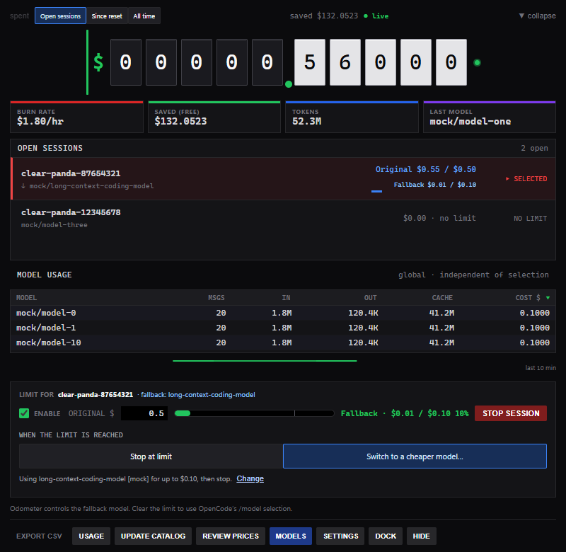
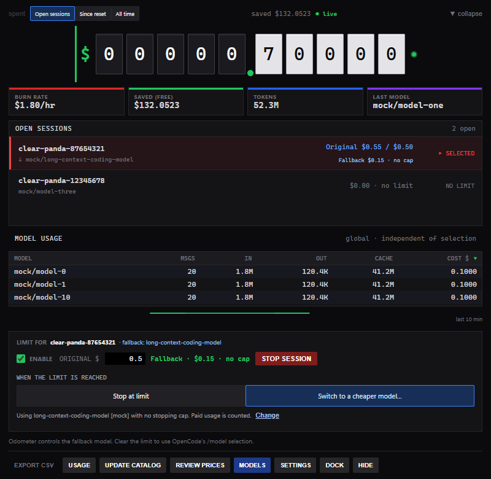
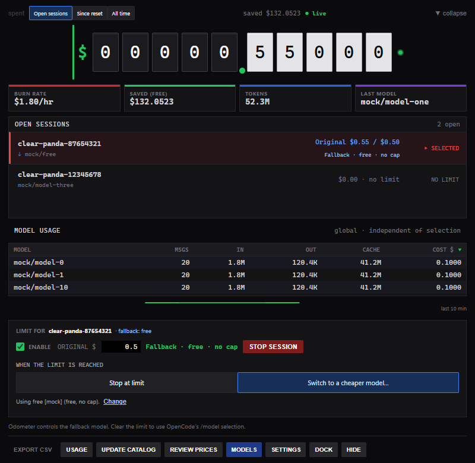

# Session budgets and automatic fallback

Odometer applies budgets to currently open OpenCode terminal UI instances (TUIs).
Each row controls one conversation and its delegated children. Model usage and
date-based reports remain global.

## Session lifecycle

A TUI registers when it opens, including on the home screen before the first
chat. Its readable identity appears in OpenCode and Odometer. The session list
comes from these presence reports rather than saved conversation history.

New entries have no limit. A limit set on the home screen follows its first
conversation. Switching that TUI to a different conversation starts without the
previous limit. Closing the TUI removes its entry and budget while preserving
usage history. Restarting Odometer preserves budgets for TUIs that remain open.

Quiet TUIs remain listed while their processes exist. On Windows, presence checks
process creation time against the reported heartbeat so a reused process ID
cannot make an old TUI reappear. Temporary blank routes and parent-session
resolution preserve an existing conversation binding.

Two TUIs displaying the same conversation do not represent independent execution.
Their spending is counted once in the Open sessions total; automatic fallback
is refused for a shared conversation.

## Setting a limit

1. Select a session row.
2. Enter a positive dollar amount and check **ENABLE**.
3. Choose **Stop at limit** or **Switch to a cheaper model…**.

Enabling starts the budget allowance at zero, even if the conversation has already
incurred costs. The aggregate Open sessions counter still includes spending
since the TUI opened. Editing an enabled limit keeps counted allowance spending
and re-evaluates the policy immediately. Disabling and re-enabling starts a fresh
allowance without erasing history.

All session limits are hard, with a warning at 75% and enforcement at 100%.
There is no grace turn. A request already dispatched can overshoot the amount;
this is a limit on subsequent requests, not a provider-side billing ceiling.

**Stop at limit** saves immediately. At exhaustion, further paid requests are
blocked. Raise or clear the limit to continue paid work. Confirmed free routes
can remain available; an unknown price or a zero provider-reported cost is not
evidence that a route is free.

## Configuring a fallback

**Switch to a cheaper model…** opens a draft. Search configured models and filter
by cost and provider. A route is cheaper when its combined input/output rate is
lower using equal token counts; actual savings depend on the token mix.
Specialised models and explicitly unsupported tool routes are disabled. Missing
tool metadata alone does not disable an available chat route.

The choice stores both provider and model ID. Select a route and press
**Switch at limit** to apply it. Cancel, X, Esc and backdrop clicks discard the
draft. Saving re-evaluates the current allowance immediately, so an already
exhausted limit can start switching at once.

Once a fallback is active, **Change** can adjust its allowance and Stop/Keep
going choice. Raise or clear the original limit before choosing a different
fallback model; settings cannot change while a switch is in progress.

For a paid fallback, configure its **Extra budget** and **After that** behaviour:

| Choice | Behaviour |
|---|---|
| Stop | Stop further paid requests when the separate fallback allowance is exhausted. |
| Keep going | Continue paid usage without a stopping cap; spending is still counted. |
| Free fallback | Continue without a paid spending cap. |

After switching, the original allowance is labelled separately. Only a paid
fallback configured to stop displays cap progress. Free and Keep going fallbacks
display **no cap**; the dock uses the active allowance rather than the exhausted
original one.

## Automatic continuation

When the original allowance is exhausted, the companion plugin:

1. Blocks new steps on the original allowance and lets running tools settle.
2. Interrupts the conversation and its known delegated work, then confirms idle status.
3. Checks completed and interrupted actions, model availability, known context
   and attachment constraints, and estimated affordability.
4. Activates the separate fallback allowance and submits one continuation in
   the same conversation, explicitly selecting the configured provider/model.
5. Checks the matching response's model before reporting the switch.

The continuation prompt asks the fallback to preserve the original scope, depth
and completion criteria, retain completed work, and verify uncertain results
before repeating actions. The model change does not guarantee equivalent response
quality. A completed task does not need another response; the fallback can be
selected for the next message instead.

Generation IDs and acknowledgements guard against duplicate continuations. An
uncertain submission is not automatically retried. A tool blocked before execution
can be retried; an interrupted tool without proof of its outcome requires caution.

Provider failures, known insufficient context, unsupported attachments,
unaffordable estimates, unsettled actions and timeouts leave the session paused
with a reason. Odometer does not silently try a different provider. Missing context
metadata permits an attempt; OpenCode and the provider validate the request.
Existing tool-permission requirements continue to apply.

## Stopping, changing limits and model routing

**STOP SESSION** cancels current activity like Esc and waits for acknowledgement.
It preserves the budget and model, suppresses automatic continuation of the
cancelled task, and leaves other chats running. A later user message follows
the normal budget policy; it does not bypass an exhausted allowance.

Raising the original limit above counted spending returns the policy to its
original allowance and resets fallback allowance spending. The original model
can be restored for one request, yielding to a different explicit OpenCode choice.
Clearing the limit releases budget-owned routing to OpenCode's selection.
Historical accounting is preserved. Lowering a limit re-evaluates it immediately.

While a fallback is active, its routing overrides OpenCode's `/model` selection.
The selected-session note explains how to release it. A Stop at limit budget
alone does not pin routing.

A deliberate manual choice saved through **MODELS** is separate. Clearing the
budget does not remove that choice; use **Use OpenCode selection** in the model
picker. See [manual switching](../README.md#switching-models).

Switch and stop notifications identify the session and return to the compact
dock when dismissed. Hide keeps Odometer running in the tray. Pausing enforcement
continues accounting and preserves the active fallback route.

## Counters, exports and storage

**Open sessions** counts usage since each currently open TUI started. **Since
reset** and **All time** include global history. Resetting the display counter
does not reset any session allowance. CSV rows and totals follow the selected
scope; see [counters and reports](../README.md#counters-and-reports).

The Usage panel groups spending by recorded local calendar day and provider/model.
Before message details are pruned, daily summaries and a message-ID index retain
accounting history and prevent duplicate replay. These grow with use; storage
sizes are shown in the panel. Older pruned amounts without dates cannot be
reconstructed into daily reports. Archived accounting is immutable.

Cleanup considers unreferenced terminal acknowledgements and closed presence or
inventory files older than seven days. It preserves accounting data, active
owners, referenced commands, unfinished work, malformed files and unread spools.
Spool/log rotation remains separate from this cleanup.

## Metadata and privacy

Configured model availability comes from the owning OpenCode instance.
[models.dev](https://models.dev) supplies catalog prices and capabilities;
instance-specific facts and local overrides take precedence where applicable.
Optional [Artificial Analysis](https://artificialanalysis.ai/) metadata provides
coding/intelligence scores and measured speed for exact model/configuration
matches. The pickers display descriptions and prices without ratings or a
benchmark-based quality order.

Set an optional key under **Settings → Optional model benchmarks**, then use
**REFRESH METADATA**. `ARTIFICIAL_ANALYSIS_API_KEY` takes precedence over the saved
key. Cached metadata remains usable during an outage; a key is not required for
startup, pricing, budgets or automatic switching.

The saved key is stored locally in `metadata_settings.json` as unencrypted JSON.
It is not returned by the application to the frontend, included in the public
metadata cache or exported to CSV. Runtime budgets, inventory, keys, logs and
conversation identifiers are private files excluded from Git.

## Enforcement and validation limits

Keep Odometer running while relying on budgets. The plugin stops enforcing an
expired or missing verdict after its heartbeat timeout. Cost events arrive after
usage, and affordability checks are estimates rather than provider quotes.
Unknown pricing can undercount spending; review it before relying on a small cap.

Automated checks cover allowance attribution, enable/edit/reset behaviour,
session lifecycle, routing release, duplicate delivery, cancellation, failed
commands, shared conversations, accounting archives and CSV scope. Browser
checks cover selection, drafts, filters, dock dimensions and notifications.
Integration harnesses use isolated OpenCode instances and a localhost fake
provider. They do not establish compatibility with every provider or tool.
See [contributor checks](../CONTRIBUTING.md) for reproducible commands.
